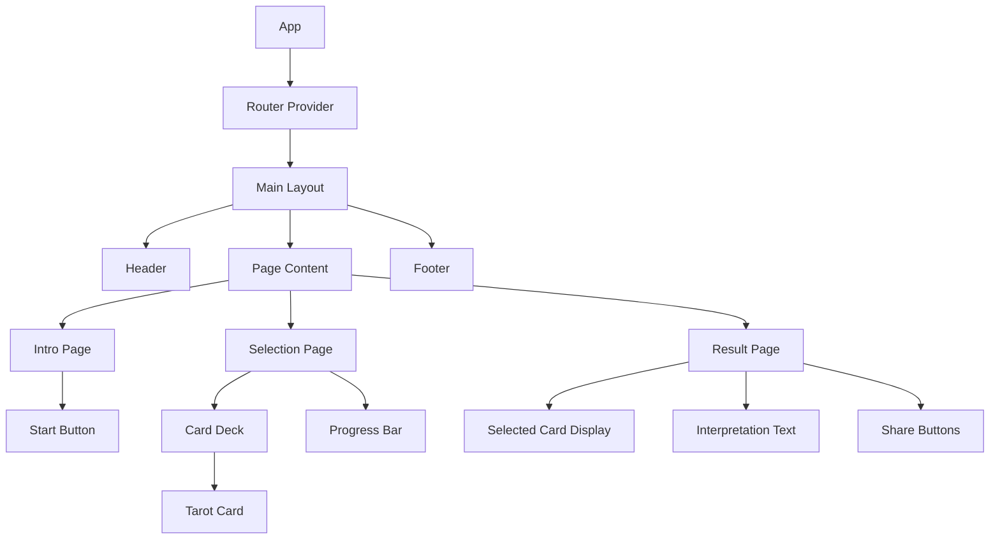

# System Architecture (아키텍처 설계서)

## 1. 컴포넌트 구조 (Component Hierarchy)
React v19의 최신 기능을 활용하여 컴포넌트를 구성합니다.

## 2. 상태 관리 (State Management)
복잡한 전역 상태가 많지 않으므로 **Context API** 또는 가벼운 상태 관리 라이브러리인 **Zustand**를 사용합니다.

### 2.1 관리할 주요 상태 (Global State)
*   **`userName`**: 사용자 이름 (선택 사항)
*   **`selectedCards`**: 사용자가 선택한 카드 목록 (Array of Card IDs)
*   **`interpretation`**: 생성된 운세 해석 데이터 (Object or String)
*   **`isSoundOn`**: 배경음악/효과음 On/Off 여부 (Boolean)
*   **`appState`**: 앱의 현재 단계 (Intro -> Reading -> Finished)

## 3. 데이터 흐름 (Data Flow)
1.  **초기화**: 앱 실행 시 `tarot-data.json` 정적 데이터를 로드 (Lazy Loading 고려).
2.  **선택**: `SelectionPage`에서 사용자 인터랙션 발생 -> `selectedCards` 업데이트.
3.  **결과 생성**: Result Page 진입 시 `selectedCards`의 ID를 기반으로 해석 로직 실행.
    *   (Basic) `tarot-data.json`에서 키워드 매칭.
    *   (Advanced) Gemini API 호출하여 동적 텍스트 생성.

## 4. 라우팅 (Routing)
`react-router-dom`을 사용하여 SPA(Single Page Application)로 구현합니다.

*   `/`: 인트로 페이지 (메인)
*   `/select`: 카드 선택 페이지
*   `/result`: 결과 페이지 (query param 등으로 결과 공유 가능하게 설계 고려, 예: `/result?cards=12,5,0`)

## 5. 기술적 고려사항
*   **Animation**: `framer-motion` 라이브러리를 사용하여 부드러운 카드 뒤집기 및 페이지 전환 효과 구현.
*   **Responsive**: 모바일 First 디자인, Flex/Grid 레이아웃 적극 활용.
*   **Performance**: 이미지 최적화 (WebP 형식 사용, Lazy Loading).
